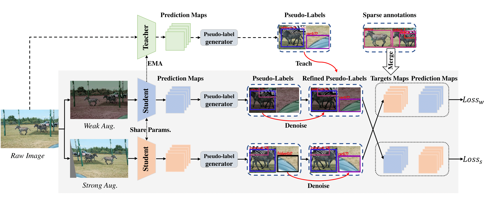

<div align="center">
<h1>Co-Student: Collaborating Strong and Weak Students for Sparsely Annotated Object Detection </h1>

[Lianjun Wu](https://github.com/wulianjun-112)<sup>1</sup>, [Jiangxiao Han]()<sup>1</sup>, [Zengqiang Zheng]()<sup>2</sup>, [Xinggang Wang](https://xwcv.github.io/)<sup>1 :email:</sup>
 
<sup>1</sup>  [School of EIC, HUST](http://english.eic.hust.edu.cn/),
<sup>2</sup>  [Wuhan Jingce Electronic Group Co., Ltd.]()


<sup>:email:</sup> corresponding author.

**ECCV 2024**
</div>

### News
* `[2024-7-2]` Co-Student is accepted by ECCV 2024!


## Abstract
The Sparsely Annotated Object Detection (SAOD) tackles the issue of incomplete labeling in object detection. Compared with Fully Annotated Object Detection (FAOD), SAOD is more complicated and challenging. Unlabeled objects tend to provide wrong supervision to the detectors during training, resulting in inferior performance for prevalent object detectors.
Shrinking the performance gap between SAOD and FAOD does contribute to reducing the labeling cost.
Existing methods tend to exploit pseudo-labeling for unlabeled objects while suffering from two issues: (1) they fail to make full use of unlabeled objects mined from the student detector and (2) the pseudo-labels contain much noise.
To tackle those two issues, we introduce Co-Student, a novel framework aiming to bridge the gap between SAOD and FAOD via fully exploiting the pseudo-labels from both teacher and student detectors.
The proposed Co-Student comprises a sophisticated teacher to denoise the pseudo-labels for unlabeled objects and two collaborative students that leverage strong and weak augmentations to excavate pseudo-labels.
The students exchange the denoised pseudo-labels and learn from each other with consistency regularization brought by strong-weak augmentations.
Without bells and whistles, the proposed Co-Student framework with the one-stage detector, i.e., FCOS, can achieve state-of-the-art performance on the COCO dataset with sparse annotations under diverse settings.
Compared to previous works, it obtains 1.0%~3.0% AP improvements under five settings of sparse annotations and achieves 95.1% performance compared to FCOS trained on fully annotated COCO dataset. 

<div align="center">

</div>


# Preliminary

The codes for our work "Co-Student: Collaborating Strong and Weak Students for Sparsely Annotated Object Detection" based on [cvpods](https://github.com/Megvii-BaseDetection/cvpods.git)

## 1. Download resnet pre-trained model (Res-50,Res-101,ResX-101-32x8d) by url as follows:
[R-50](https://dl.fbaipublicfiles.com/detectron/ImageNetPretrained/MSRA/R-50.pkl)
[R-101](https://dl.fbaipublicfiles.com/detectron/ImageNetPretrained/MSRA/R-101.pkl)
[X-101-32x8d](https://dl.fbaipublicfiles.com/detectron/ImageNetPretrained/20171220/X-101-32x8d.pkl)

## 2. Prepare data

If you want to retrain our model on MS COCO, you need to ensure that the COCO dataset exist in your machine. Or you can head to [MS COCO](https://cocodataset.org/#download) to download the datasets.

Assume you have your COCO dataset in "/your-path/coco", and expected dataset structure as follows:
```
/your-path/coco/
            annotations/
            train2017/
            test2017/
            val2017/
```

link your COCO dataset to CoStudent root by:
```shell
(for Windows, need Administrator permissions) mklink /D "/path/CoStudent/datasets/coco" "/your-path/coco/" 
ln -s "/your-path/coco/" "/path/CoStudent/datasets/coco"
```

Download the sparse-annotations "missing_50p", "easy", "hard", and "extreme" from [Co-mining paper](https://drive.google.com/drive/folders/1jGl7IUxwJ3xRS0CcovzB7KEWMGZB555X?usp=sharing), which are publicly available. 
The annotation of "keep1" is from the authors of [SIOD paper](https://arxiv.org/abs/2203.15353) and [here](https://drive.google.com/drive/folders/1mJayvvNkmvur7IOG17-hz3AHQ2yPWfUf)


## 3. Prepare environment

**Step 1.** Create a conda environment and activate it.

```shell
conda create --name cvpods python=3.6 -y
conda activate cvpods
```

**Step 1.** Install corresponding version of torch and torchvision depends on the version of Cuda compilation tools you use.

Fisrt, check the version of Cuda compilation tools by:
```shell
nvcc -V
```
Assume your Cuda compilation tools vesion is 11.1,
```shell
pip install torch==1.8.0+cu111 torchvision==0.9.0+cu111 -f https://download.pytorch.org/whl/torch_stable.html
```

<!-- **NOTE** (for Windows) [Build Tools for Visual Studio 2019 (version 16.9)](https://download.visualstudio.microsoft.com/download/pr/245e99d9-73d8-4db6-84eb-493b0c059e15/b2fd18b4c66d507d50aced118be08937da399cd6edb3dc4bdadf5edc139496d4/vs_BuildTools.exe) is needed. -->

**Step 2.** Install other needed packages
```shell
pip install -r requirements.txt
```

**Step 3.**  Build cvpods as follows:
```shell
cd /path/CoStudent
pip install -e .
```

# Training COCO
You can train our mothod CoStudent on COCO-miss50p for 12 epochs by the following command:
```bash
bash tools/train.sh
```

## Citations
```bibtex
@inproceedings{wu2024CoStudent,
      title={Co-Student: Collaborating Strong and Weak Students for Sparsely Annotated Object Detection}, 
      author={Lianjun Wu, Jiangxiao Han, Zengqiang Zheng and Xinggang Wang},
      year={2024},
      booktitle={ECCV}
}
```

## License

Released under the [MIT](LICENSE) License.


